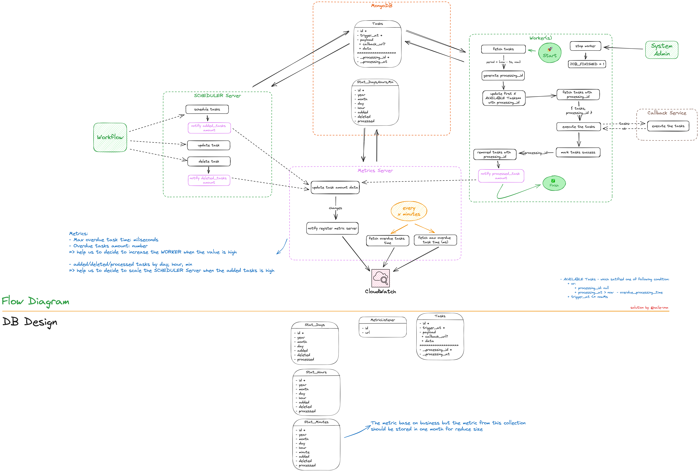

## What is this repo?

This repository is used to set up the entire application for this app.

## Solution Design Diagram



## Installation Instructions

### 1️⃣ Clone devenv repository

```shell
git clone git@github.com:futask/devenv.git futask
```

### 2️⃣ Download all related repositories

Navigate to the `futask` folder, which was created by the previous command.

```shell
cd futask
```

Then load all sub-repositories inside the `futask` repository using the following commands:

```shell
git submodule init
git submodule update
```

After that, all the code from all the required services will be downloaded to the `futask` folder.

### 3️⃣ Set up Environment

- Create a `.env` file from the `./.env.example` file.
- Modify the values in the `.env` file according to your preferences (not recommended, as all values are set up to be ready to run the tests).

### 4️⃣ Build and run Docker containers

```shell
docker compose up -d
```

By running the above command, all the required services will be started.

## Test the app 🚀

After successfully building the services mentioned above, you can access the following endpoints:

- Scheduler Endpoint: [http://localhost:8000](http://localhost:8000)
- Worker Endpoint: [http://localhost:8100](http://localhost:8100)

### Import Endpoints

Please use the Thunder Client VS extension to import the following files:

- Endpoints file: `./thunder-requests_futask.json`
- Environment file: `./thunder-environment_futask-dev.json`

Then, enjoy every small moment!! 💃🕺

Thank you! 🥳🥳🥳
